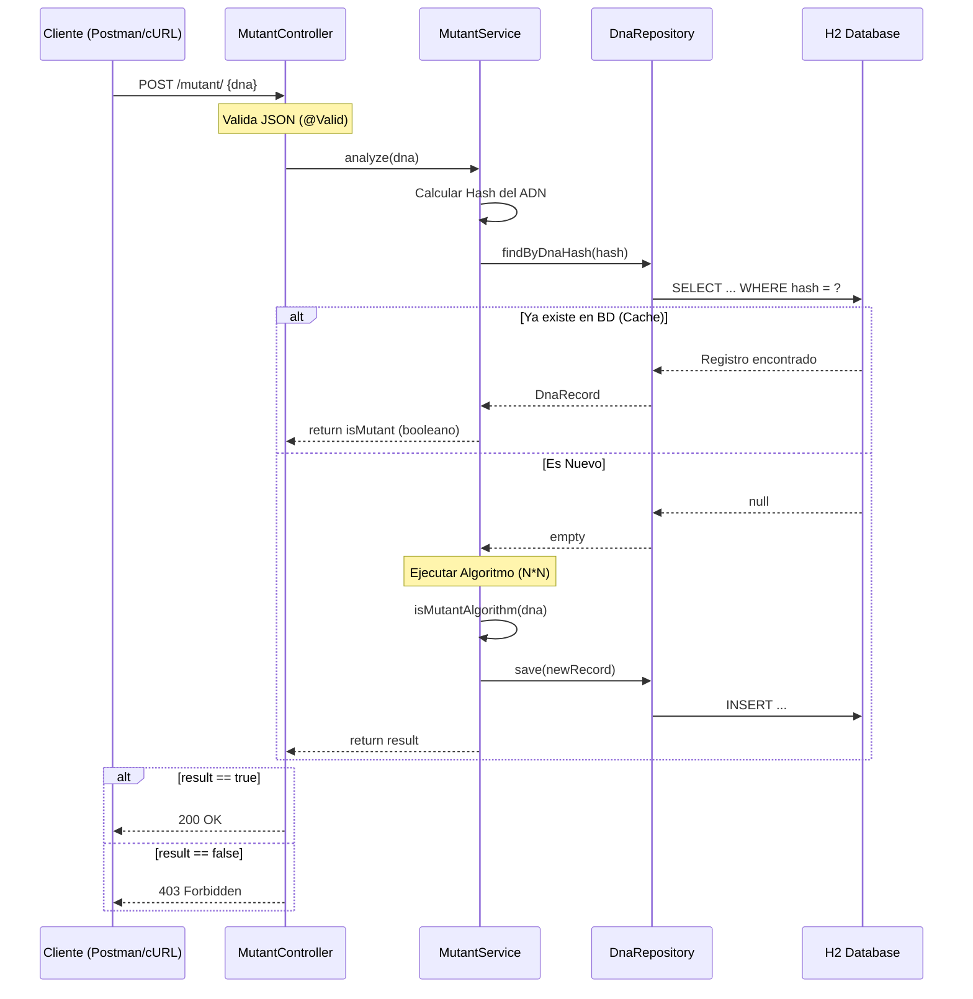

Global Integrador - Máximo Perea 51033 3K09
# 🧬 Mutant Detector API

  

API REST desarrollada para identificar mutantes basándose en su secuencia de ADN. Proyecto realizado como desafío técnico para **MercadoLibre / Magneto**.

🔗 **URL de la API en Producción:** [https://magneto-mutant-detector-gradle.onrender.com](https://magneto-mutant-detector-gradle.onrender.com)

---

## 📋 Descripción del Proyecto

Magneto quiere reclutar la mayor cantidad de mutantes para su ejército. Este sistema permite detectar si un humano es mutante analizando su secuencia de ADN mediante un array de Strings.

**Regla de Negocio:**
Un humano es mutante si se encuentran **más de una secuencia de cuatro letras iguales** (A, T, C, G) en dirección oblicua, horizontal o vertical.

### 🚀 Tecnologías Utilizadas
* **Lenguaje:** Java 21
* **Framework:** Spring Boot 3.2.3
* **Base de Datos:** H2 Database (En memoria, optimizada con índices).
* **Testing:** JUnit 5 + Mockito.
* **Despliegue:** Docker + Render.
* **Build Tool:** Maven.
* **IA:** Gemini 3 Pro.


---

## ⚡ API Endpoints

### 1. Detectar Mutante
Analiza una secuencia de ADN y guarda el resultado en la base de datos.

* **Método:** `POST`
* **URL:** `/mutant/`
* **Headers:** `Content-Type: application/json`

**Ejemplo de Body (Mutante):**
```json
{
    "dna": [
        "ATGCGA",
        "CAGTGC",
        "TTATGT",
        "AGAAGG",
        "CCCCTA",
        "TCACTG"
    ]
}
```

## 🚀 Instrucciones de Ejecución

### Prerrequisitos
* Java 21 (JDK)
* Git (Opcional, para clonar)

### 1. Ejecutar la API localmente
Si deseas levantar el servidor en tu propia máquina (localhost:8080):

```bash
# Clonar el repositorio
git clone [https://github.com/TU_USUARIO/mutant-detector.git](https://github.com/TU_USUARIO/mutant-detector.git)

# Entrar a la carpeta
cd mutant-detector

# Ejecutar con Maven Wrapper (Windows)
./mvnw spring-boot:run

# Ejecutar con Maven Wrapper (Linux/Mac)
./mvnw spring-boot:run
```

## 📊 Diagrama de Secuencia

Flujo de ejecución cuando se recibe un ADN:


